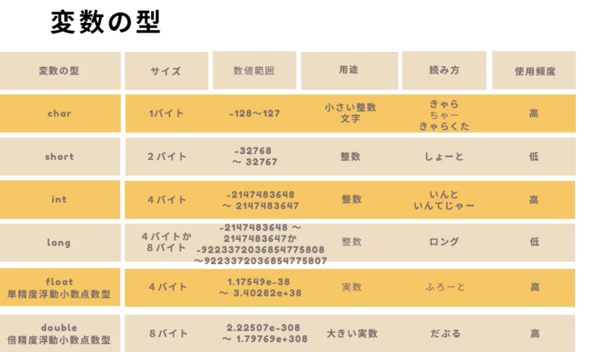

なぜ、a.outでは実行できないのか?(./a.outにする必要があるのか)

    UNIX（Linux）は、DOS（Windowsのコマンドプロンプト）とは違い、カレントディレクトリにはPATHが通っていないのが普通です。したがって、a.outを実行するには、カレントディレクトリ上にあるファイルであることを明示するため、頭に./を付けて./a.outとコマンド入力する必要があるのです。
    https://gihyo.jp/dev/serial/01/c-programming-introduction/0004


「# include <stdio.h>　」は何か
    ヘッダファイルを読み込む処理
    ヘッダファイル：複数のプログラムで使う処理をヘッダファイルとして別に書き出す。(多分pythonのimport的な)
    stdio.hは standard io で、入出力を行うためのヘッダーファイル。gccによって提供されている。


```c


int main(){
    int a; // intの大きさでaという領域(メモリ)を確保してください
        //ちなみにintは4バイト

    a = 10;

    return 0;

}

```



a.outのaは何？
    アセンブラ　アウトプットのa.
    「gcc -o ./a.outの代わりの名前 ファイル名.c」で自由に保存する時の名前変えられる


C 言語のプログラムでは、どうして色々なデータ型を使い分けなければならないのでしょうか。int 型など使わずに、全てを double 型にできれば簡単です。

    プログラムを高速に実行するためです。普通のコンピュータは、例えば整数と小数で異なる演算回路（ハードウェア）を使いますが、整数用の回路の方が高速です。ですから、値の範囲が整数なら int 型を使った方がよいのです。そのぐらい、コンピュータが自動的に判別してくれればよさそうなものですが、少なくとも C 言語ではそのようなことはしてくれません。

    https://tcs.c.titech.ac.jp/csbook/c_lang/chap2.html


   関数名の前に書いてある型は、関数の戻り値の型。main 関数にも return 文を書くが、その戻り値は通常利用されない。この場合、 一般的に値が 0 の場合には実行が成功したことを、それ以外の値の場合は失敗したことを表すのが慣例。
   https://tcs.c.titech.ac.jp/csbook/c_lang/chap3.html


Cの配列を扱う時、宣言時の大きさを越えたインデックスを用いても、コンパイルエラーとはならず、また、プログラムがどう動作するか全く予測できない。
https://tcs.c.titech.ac.jp/csbook/c_lang/chap6.html


char 型の配列の要素には、いつでも新しい値を代入することができますが、配列そのものに文字列をまとめて代入することはできません。= の右側に文字列を書くことができるのは、配列を宣言するときだけです。
> https://tcs.c.titech.ac.jp/csbook/c_lang/chap6.html
```c
char hello[] = "Hello!";    /* OK */
hello[0] = 'h';             /* OK */

hello = "Aloha!";           /* Error */
```


charの配列の特別な宣言方法と、終端文字"\0"
```c
char hello[] = "Hello!";


char hello[7];
hello[0] = 'H';
hello[1] = 'e';
hello[2] = 'l';
hello[3] = 'l';
hello[4] = 'o';
hello[5] = '!';
hello[6] = '\0';    /* 文字列の最後を意味する文字 */

```
https://tcs.c.titech.ac.jp/csbook/c_lang/chap6.html


ポインタ
    - ある変数のメモリ上のアドレスを値として格納する変数
    
```c
int  x = 5;     /* 変数 x    の値は 5 */
int* p = &x;    /* ポインタ p は変数 x をさす */
```
    - &x
        - 変数xのポインタ(メモリ上のアドレス)を返す演算子
        - アドレス演算子
    - *p
        - ポインタpが指す変数が格納している値を返す演算子


C言語の名前の由来
- B言語というものをより便利に作り替えたのがC言語
- B言語は BasicCPL というこれまた別の言語を継承して作られた言語
- https://www.quora.com/Why-is-C-programming-language-named-so-Why-C-and-not-any-other-letter-like-A-M-N-V-etc


文字列リテラルはポインタとして扱われる

```c
char *msg = "An error occurred";
```
- 文字列リテラル "An error occurred" がメモリに配置される。
- その先頭アドレスが msg に代入される。

>List 11-1 での "123" のような文字列リテラルを使うとき， 配列の宣言は行っていません． しかし，こうした文字列リテラルは， 記憶域上のどこかで配列のように保持されます（第１版 Fig.11-1，第２版 Fig. 11-2）． 配列を宣言していないのに， 自動的に配列が作成されたかのようです． 文字列リテラルは実質的に配列なので， 評価すると先頭要素（つまり，先頭の文字）へのポインタとなります．
- https://lecture.ecc.u-tokyo.ac.jp/lterao/textbook/chap11/chap11.html


```
void errorHandler (char *msg) {
  perror(msg);
  exit(1);
}
```
perror は ```perror("This is error message")```のように使って、エラー出力に文字列を出力できる。
引数の*msgは、引数はポインタですよ、と示している。
文字列リテラルは、評価されると、先頭の文字のアドレスを返す。
つまり、perrorは先頭の文字のアドレスから、終端文字が出てくるまでをエラー出力に出している。


コマンドライン引数
    Cのプログラム実行時に、コマンドラインから与えることのできる引数
```c
// これを
main(){...}
// こうすると渡せるようになる
main(int argc, char *argv[]){}
    ....
```
    argcとして、コマンドライン引数の数を扱えて、argvとして各引数が入った配列を扱える

https://www.ritsumei.ac.jp/~mmr14135/johoWeb/cmnds.html
